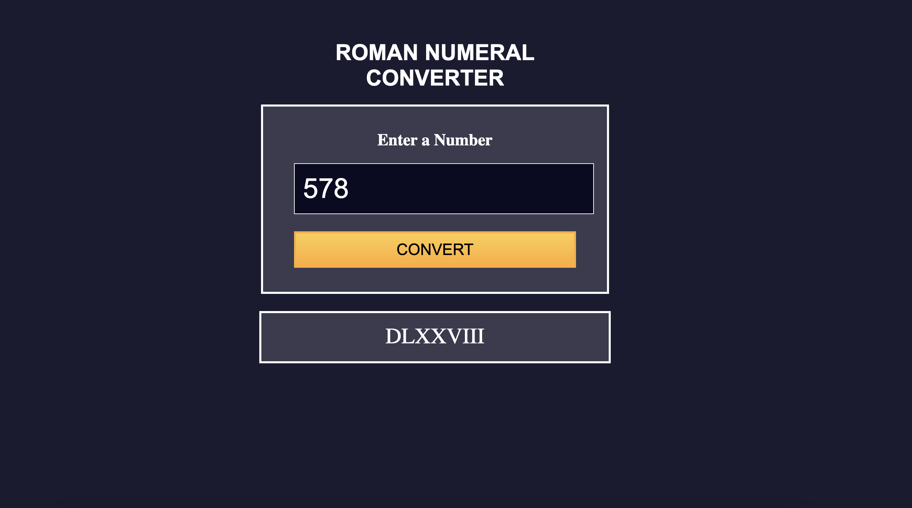

#  Roman Numeral Converter

This is a simple and elegant **Roman Numeral Converter** web app built with **HTML**, **CSS**, and **JavaScript**. It allows users to convert numbers into Roman numerals with input validation and dynamic feedback.

---

## 📸 Screenshot



---

## Features

-  Converts numbers to Roman numerals instantly.
-  Input validation with clear alerts:
  - No empty inputs
  - Only numbers between **1** and **3999** accepted
-  Instant output display
-  Responsive and modern UI with hover and focus effects

---

##  How It Works

1. Enter a number into the input field.
2. Click the **"Convert"** button.
3. The Roman numeral equivalent will be displayed.
4. If invalid input is given, helpful alerts guide the user.

---

##  Technologies Used

- **HTML5** – Structure of the webpage
- **CSS3** – Styling with responsive layout and color scheme
- **JavaScript (Vanilla)** – Logic for conversion, validation, and UI feedback

---

##  Roman Numeral Conversion Logic

The JavaScript logic uses a descending map of Roman numeral symbols and repeatedly subtracts from the input number while building the result string.

```javascript
const romanMap = [
  { value: 1000, symbol: 'M' },
  { value: 900, symbol: 'CM' },
  ...
  { value: 1, symbol: 'I' }
];
